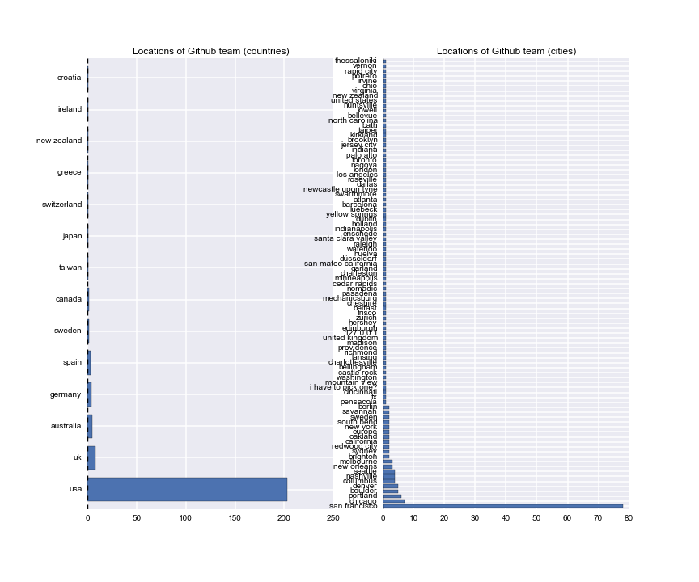
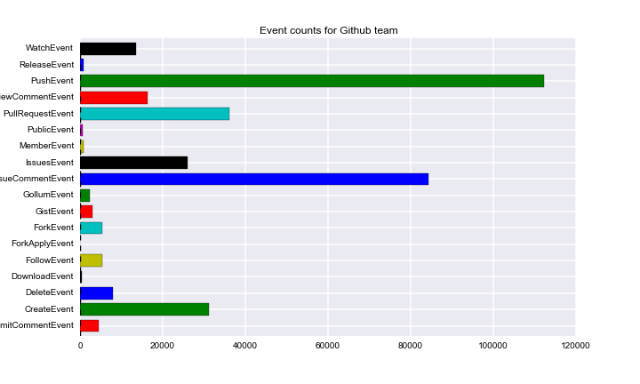
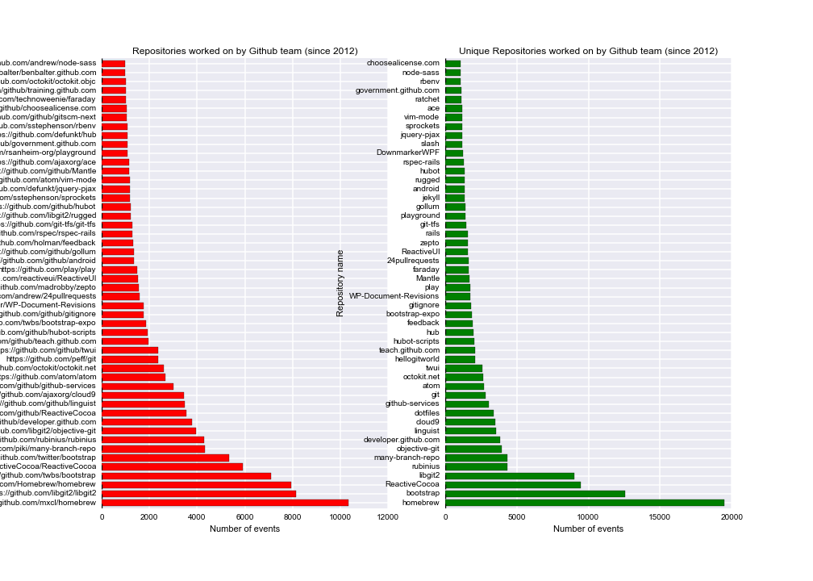
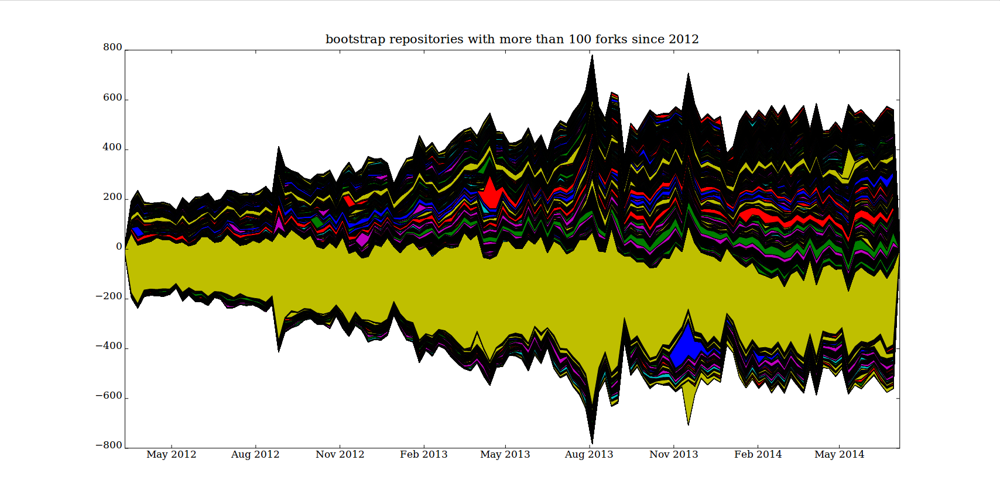
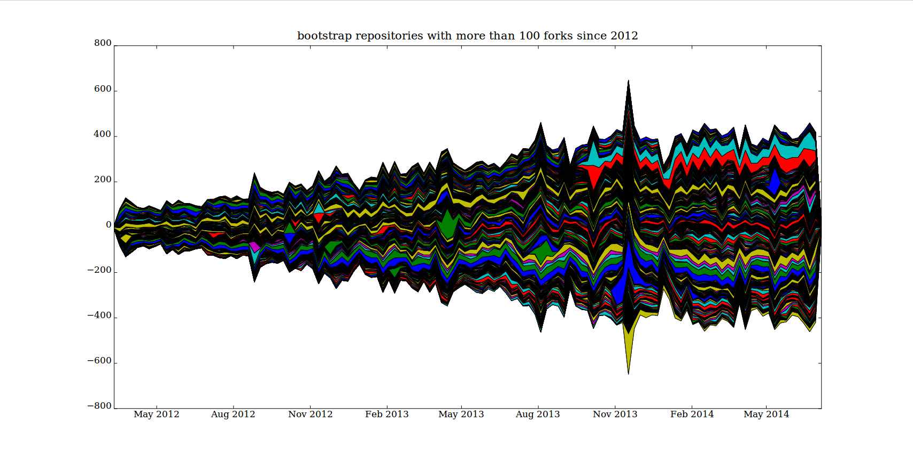

# Code-crowd: how software repositories express urban life

Adrian Mackenzie
Sociology Department, Lancaster University
a.mackenzie@lancaster.ac.uk

## Abstract
Is code an expression of urban life? This paper analyses around 10 million software repositories on GitHub.com from the perspective of how they include cities.  The methodology here relies on data-intensive work with bodies of code at a number of different levels. It maps the geographies of GitHub organisations and users to see how location anchors coding work.  More experimentally, it tracks how urban spaces, movements and architectures figure in and configure code. The paper's focus is less on how code shapes cities and more on apprehending code and coding as a way of experientially inhabiting cities. This approach might better highlight how code expresses urban experiences of proximity, mixing, movement, nearness, distance, and location. It might also shed light on the plural forms of spatiality arising from code, particularly as algorithmic processes become more entangled with each other. 

## Introduction: centres, rules and indeterminacies

> The initial step can be made through the venerable geographical act of mapping the expanding realm of machinekind, clearly part of the remaining terra incognita. [@Horvath_1974, 188]

Writing in 2002, Nigel Thrift and Shaun French asked: 'is there any way of making a more general assessment of software in the city?' [@Thrift_2002,  314].  They sketch some possibilities, ranging from hegemony to haunting:

> It would be easy at this point to fall back on some familiar notions to describe software's grip on spaces like cities. One would be hegemony. But that notion suggests a purposeful project, whilst software consists of numerous projects cycling through and continually being rewritten in code. Another notion would be haunting. But again the notion is not quite the right one. Ghosts are ethereal presences, phantoms that are only half- there, which usually obtain their effects by stirring up emotions – of fear, angst, regret, and the like [@Thrift_2002, 311-312].

Their own  empirical response to the question begins with the Y2K bug, and the long lists of software potentially affected by it: keypad locks, pagers, solar panels, smoke detectors, camcorders, VCRs, elevators. Although these lists now look dated, when a similar listing would include so many  things that didn't exist in 2002, Thrift and French's description of the effect of software development on urban space remains recognisable: 'we will exist in a broadband world in which the internet will be a permanently available ‘cloud’ of information able to be called up through a number of appliances scattered through the environment. These appliances will be something more than portals for information. Rather, like many other devices which will not have internet connections, they will be "practice-aware"' (315) and 'will, through a process of cultural absorption into practices, sink down from the representational into the non- representational world, so becoming a part of a taken-for-granted set of passions and skills' (318). The fact that these developments more than a decade later are still very much in train suggests that there is something quite predictable about the development of software and coding in organising urban life and spaces.  

What of the more general analysis of software in the city that Thrift and French propose on the basis of the continually cycling and rewriting of code? In 2002 they listed three geographies that were driving code into cities: a geography of *writing code*, a geography of *power and control*, and a geography of *indeterminancy.*  

>  The first of these geographies is the most obvious, the large and complex geography of the writing of software – of the production of lines of code – a geography that takes in many different locations and many different languages and which has been built up progressively since the invention of programming in the 1940s [@Thrift_2002, 323].

According to Thrift and French, the geography of software writing clusters around  key places and regions: Silicon Valley, New York, London, and a number of auxiliary software mass production zones (often concentrating on tasks like consulting, testing and support) in countries like Ireland and India. China, Russia and Brazil are not mentioned.   Second, a geography of power, which they conceived in Foucaultean terms as the conduct of conduct, or massive proliferation of corporeally practiced rules, was unfurling through software: 'in essence, we can say that it [software] consists of rules of conduct able to be applied to determinate situations' [@Thrift_2002, 325]. Through power-geography, software increasingly interlinks rather than compartmentalises urban processes. (Again,  the ongoing growth of data analytics, virtualizing computing infrastructures, social media, mobile apps and sensors is largely consistent with this analysis of power.) The final geography is the most open and the least geographically localised: 

> the general profusion of software, its increasing complexity and consequent emergent properties, all count as means of producing playful idioms that have not been captured by dominant orders. Software's very indeterminacy and lack of closure provide a means of creating new kinds of order (328). 

These playful idioms are largely irreducible to the centres of coding or power-laden control situations, and therefore will take on singular forms, unexpected locations and non-representational aspects. Where does the geography of indeterminacy take shape? Against various attempts to see software and code as either hegemonic, as law, as an epochal shift, as what has always haunted writing, or as the epitome of the post-human technics, Thrift and French sketched  the phenomenality of code  as a form of traffic: 

> Software is more like a kind of traffic between beings, wherein one sees, so to speak, the effects of the relationship. What transpires becomes reified in actions, body stances, general anticipations. We would argue, then, that software is best thought of as a kind of absorption, an expectation of what will turn up in the everyday world.[@Thrift_2002, 312]

These formulations are the most elliptical in the paper.  But the 'traffic between beings' they refer to here, the reification of 'general anticipations,' the curiously contrasting descriptions of software as absorption _and_ expectation could be seen as implicitly urban. They concern 'traffic' and  'the everyday world.'

More than a decade later, when  we think about software  in ways that apprehends both its power-laden capacity to format lives, experience, space and time, and at the same time, sees software as itself a multiplicity, with its own becomings, differences, and changes, do these geographies help  us understand  coded cities? Writing in 2014, Thrift again asks about code in the city:

> Take just the case of coded cities understood as a whole. Should we think of them simply as projections of an autistic capitalist power in which all consequences are externalized? Should we think of them as entities gathered around matters of prescribed concern and uninterested in much that lies outside them? Should we see them as tied into a kind of ethic of care by the need to roll over systems which demand resilience? Should we see them as having an increasingly involved dream life, based on projection and retrojection of all the searches, blogs and tweets that are continually being generated? Should we see them as geometric beings, born out of constant requests for navigation? Should we see them as the result of newly found abilities to represent arising out of advances in visualization? There is no set format or single cause but what is clear is that it is increasingly possible for these entities to learn – in however a limited way – to transform themselves, to author themselves either through emergent tendencies arising out of complexity or through simple happenstance which places them in unexpected situations which require adaptation. [@Thrift_2014, 13]

Thrift maps out an almost psychedelic sixfold  topography of the 'coded city' -- as externalization of capitalist power,  as prescribed matter of concern, as care-laden responses to the demand for resilience, a projected-retrojected dream life, as navigational geometry, and as materialized visualisation. And then suggests that something links this diversity: the possibility for 'these entities to learn ... to transform themselves.'   Echoing the 2001 discussion of indeterminacy, he attributes this possibility to 'emergent tendencies arising out of complexity' or 'unexpected situations which require adaptation.' 

Although I like the sixfold evocation of the coded-city, I don't find emergence or adaptation in general satisfying explanations of transformation. The 2001 formulations on indeterminacy and 'traffic in beings' occasioned by cycling and rewriting codes appear more promising to me because they suggest both the growth in code and the possibility of  empirically tracing some forms of movement. I therefore propose that we understand coded cities' 'capacity to learn' most immediately in terms of  *traffic in code.* The 'authoring,' the 'learning', and the transformations should not only be traceable in code, but coding itself is one place where externalizations, matters of concern, geometries,  projections, visualizations, resilience-care, etc. come together and affect each other.  

Exploring the code traffic entails a theoretical move and a theory of movement. The theoretical move is understand the  'traffic between beings' as moving and mixing along various paths (such as those described by Thrift in 2014: projection, geometry, matters of concern, care-resilience, externalization, visualization, etc.) through processes of _imitation_.  I'm drawing on crowd sociology, including the work of Gabriele Tarde and Robert E. Park, as a theory of imitative movement.  For both Tarde the microsociologist of crowds and Park the urban sociologist,  imitation is a tremendously powerful shaping force that semi-consciously effects repetition and invention, and generates new social forms of various kinds [@borch2012politics, 58, 144]. In particular, Tarde speaks of  'coadaptation of imitative fluxes, a cooperation, even in an individual brain, but always a multitude of agents social and infinitesimal, and their ordinary ideas' [@Tarde_1902, 270]. While there is much to discuss here (for instance, Tarde's political conservatism and anachronism poses analytical problems), the 'coadaptation' of imitations in combination with a  multitude of infinitesimal agents, beneath and around individuals, suggests  some ways of tracking tendencies  in code.  Examining patterns of imitation in code moves the emphasis away from code-shaping-cities to code-as-crowd. In the code-crowd, imitation is not just follow-the-leader, although this is quite prevalent, but also mutual shaping of imitative fluxes running between people and machines in places.[^1]

[^1]: This, I should note, is a departure from most crowd theory, crowd psychology and crowd sociology. In most cases, objects hardly figure at all. As I will sketch below, points of identification occurs between systems, platforms, protocols and patterns just as much as  between individuals. 

To treat *code-as-crowd* is not to deny the production and power geographies of code. It is not to say that code does not still act on cities, on space, on public and private practices.  High profile and much discussed changes taking place in computational platforms (mobile devices, cloud, etc) and in algorithmic processes (machine learning) intricately reorganise urban life. What transpires there is rapidly reified in actions, body stances, etc.   But it might also be worth seeing how cities, with their massive centralising tendencies, with their sometime globe-spanning relationalities, with their density of infrastructures, with their high rates of reconstruction and repair, and above all with their affective-practical-epidemiological contagions _crowd_ into  contemporary software. We would, from this standpoint, no longer concentrate on following how software, code and algorithms emanate from global centres  as hypervisory control structures  reorganizing cities.  Furthermore, we would no longer focus on isolated pieces of code, systems or applications but on the transverse flows that change how code itself moves and takes shape. We would apprehend coding itself as something closer to pedestrian and vehicle movements in a busy street. That is to say, we might attempt to see software and code as  noisy, crowded, propagating aggregates in which juxtapositions, proximities and patterns of imitation multiply through each other, or *convolve*. To see code-as-crowd might bring us a few steps closer to the traffic in beings that transforms itself. The practical paths that opens out from seeing code-as-crowd concerns what we should look  in studying software and code. If code is a kind of traffic between beings, if is not only a community but a *metacommunity,* not only an ecology but a crowd, then we need to find places where shape-shifting crowds assemble in code.[^2]

 [^2]: I'm not going to discuss this in any great detail here as this would require a lengthy methodological digression. In what follows, however, various elements of a different kind of research practice in software-code as relational traffic, or code-as-crowd, are in play, and they draw on various code and data infrastructures ranging from the APIs, cloud analytics platforms such as Google BigQuery, newer forms of database and interactive data analysis environments such as `ipython` and `R`. 

## From crowd-sourcing to source-code crowding: `git` as code traffic

We can glimpse some of the traffic in code via source code repositories. A huge number of code repositories (possibly around 50 million) are now hosted publicly online at code repository sites such as GitHub.com, Bitbucket.com, code.google.com and SourceForge.com.  Focusing on one of these repository hosting platforms -- GitHub.com, allegedly the 'largest code repository on planet' -- might be a way to begin to find a way of beginning to see traffic in code, and to track how co-adaptive, infinitesimal fluxes flow.[^3]  The name 'GitHub'  embodies a tension.  `git`, an English word for a male person who acts foolishly or annoyingly, was chosen by Linus Torvalds in 2005 as the name for a new concurrent versioning system for source code, the written texts on which nearly all software development pivots. In 2002, Torvald's work on GNU/Linux  epitomised for many people the emergent power of open source collaboration -- 'crowd-sourcing' -- on the internet to build things outside the geographies of the software industry.  (But even then, as Thrift and French observed,  Linux was a quite centralised hierarchically and industry-supported software project). In turn, `git` is a piece of software,   a revision control system for code that allows incremental changes made by many people working a common software project to either coexist or flow together. `git` is today probably the most widely used revision control system for code, followed by the interestingly named `subversion`. `git` was meant to be radically de-centralised in the sense that no particular instance of a git repository would be the 'master.' 'Local' and 'remote' repositories matter to `git` but their differences are only relative. Your local git repository is my remote. And my local git repository is your remote. In principle, a decentralized network of repositories  'push' and 'pull' code to each other. Different repositories would clone and branch off from each other, and occasionally would merge again, but not necessarily.  The geography of coding becomes less aligned to individual developers in specific times places and times, and more open to a range of different styles of  code movement, ranging from a miasma of micro-projects through to vast hierarchical code contortions. In practice, a whole series of converging and diverging movements of cloning, forking, pulling, pushing, requesting, branching and merging comes out of `git`.  These movements, while certainly not unique or unprecedented in the history of inscriptive techniques,  occur on a variety of scales. For instance, some `git` commands replicate whole bodies of code, while others simply add, remove or alter small bits of code. These scale-variations, I would suggest, matter to the flows of imitation that occur. Movements of code can take place very incrementally, as small bits of code move around and they can take place on a large-scale as whole bodies of code travel between different bits of software. `git` as a contemporary site of coding merits much more empirical description than this, but for the present purposes `git` represents the distributed cycling and re-writing traffic in code. 

[^3]: It might also be a way of undermining the over emphasis on algorithms that  blocks light, I would suggest, on the richer cultural and social traffic in code forms.

Since late 2007, GitHub has provided  a  hosting platform for many git repositories. Obviously the name 'GitHub' adds a 'hub' to the de-centred flows of `git`.  Given the multiplying scales of code traffic, what do the large code repository platforms like  GitHub add?  From the perspective of  the `git` software, GitHub is just another remote  code repository. But given that many, in fact around 13 million, local `git` repositories have GitHub.com as their remote repository, then GitHub becomes a hub for `git.` The network and code traffic that now runs through GitHub is on the scale of a mid-size social media platform. That is, with 13 million repositories, 6 million developers, and around 250 million events in the public event stream, GitHub itself is a kind of code city. It expresses something of the coded city, and the six-fold tendencies we discussed above should be legible there in various combinations. 

## `git` in code-cities

In the spirit of `git`, GitHub.com as a platform, and indeed as  a _social media_ platform for coding, promises a radically de-centered patterning of movement. Several hundred GitHub staff are scattered across a  dozen or so countries, a somewhat dispersed geography for a relatively specialised software company started in 2007 in San Francisco. GitHub work life is also putatively non-hierarchical, with no management hierarchy, only a `git`-like structure of fluid teams working on projects.  In principal, GitHub itself therefore makes itself into something like a crowd or a swarm.[^4]  GitHub as a social media platform adds many layers of social media-style interface to code repositories, which by tradition have been rather austere almost Reformation-style architectures. That is, they adorn code repositories with all the social media-style apparatus of following, watching, liking, and tagging. So the social life of code repositories is formatted much more in terms of watchers and followers  in the same way that messages  on Twitter or pages on Facebook are watched and followed. Imitation and suggestion are very much the modus-operandi of coding on GitHub.

[^4]: The only problem with this is that the CEO and  GitHub co-founder, Tom Preston-Werner (a.k.a `mojombo`, id = '1'  in the GitHub user list -- in other words, the first Githubber ever) has recently had to step down after much publicised allegations of sexist and discriminatory language and behaviour in the workplace [@TBA]. I largely leave the workplace dynamics of GitHub aside here, but they are symptomatic.

How would a social media platform affect the traffic in beings or the cycling-rewriting practices of coding? If we look at the 233 staff listed as the GitHub team, there is some evidence of their crowd-networked existence as they write code to socially network coding. Githubbers such as `defunkt`, `mojombo`  or `technoweenie` have thousands of followers and hundreds of repos (i.e. repositories) to their names. Some of their repositories are heavily _forked_ (copied), suggesting that 'passionate imitation' occurs around their code.  Precisely what is being followed here requires more detailed investigation, but these several hundred team members all use GitHub itself to do their work on building GitHub. So the hub-ness or centrality of GitHub  is something to be produced or made via a combination of geography, rules of conduct and new forms of order. As a repository of repositories, GitHub's mode of existence as code is a recursively generated movement propelled in part by the Githubbers' network of repositories and their interconnections with other repositories. 

The geography of their work on GitHub is still very much centred on San Francisco, despite claims of de-centralization. Geographic proximity still matters in code in many settings. But this centring is perhaps less important than the kind of movements that occur in and around it. The table below offers a view on what happens as the several hundred Githubbers work on GitHub as a  platform.[^5] It is important to note that only some of the GitHub code appears here. The GitHub team has private repositories.  The most recursive repository of all, `github/github`, the repository that contains the code for whatever GitHub itself is, remains private.

[^5]: We can see some of what the GitHub team has been doing in GitHub repositories by running queries against the GitHub API (Application Programmer Interface) or using the GithubArchive.org archived datastream of GitHub activity. All of the numerical data in this paper results from such queries. In the case of Table 1, the query process went: find all the public repositories on which the named 'actor' works, and count the different actions they perform on those repositories. If we run this query for all 233 Githubbers as well as `mojombo`, then something of the network of work done on GitHub itself begins to appear. 

type                               count
------------------               ---------
PushEvent                        112028
IssueCommentEvent                 84098
PullRequestEvent                  35990
CreateEvent                       31080
IssuesEvent                       25953
PullRequestReviewCommentEvent     16390
WatchEvent                        13627
DeleteEvent                        8033
FollowEvent                        5400
ForkEvent                          5283
CommitCommentEvent                 4542
GistEvent                          3063
GollumEvent                        2260
ReleaseEvent                        910
MemberEvent                         897
PublicEvent                         569
DownloadEvent                       350
ForkApplyEvent                        6
-------------------------------------
Table 1: Repository events generated by GitHub Team since early 2012

We can see the  events shown in Table 1 (and Figure 2)  as rough indications of movements in code. In some ways, the formatting of the events in the categories shown in Table 1 is problematic for our purposes because these formats already occlude differences in practice. They mix `git`-related practices such as forking or committing with GitHub-related practices such as pull-request or following. Disentangling what belongs to `git` from what GitHub has added would be difficult, but then this is precisely the kind of thing that would happen in the code-crowd. Putting this difficulty aside, the ratio of different event types suggests something of the flow of code. While PushEvents embody code writing, many other events, including IssueCommentEvents, PullRequestEvents,   IssueEvents and WatchEvents, point to different kinds of traffic in code. 'Social' events outweigh the technical events. 

## GitHub as collective imitation machine

The GitHub team has participated in some way or rather (including just watching) in a total of 17000 public repositories, but they work much more heavily on several hundred of these (see Figure 3).

The top repositories  present a fragmented view of  GitHub  as an imitative process. There are quite a few that clearly relate to GitHub or `git` itself. It is hardly surprising that Githubbers contribute to the `git` repository or re-implementations of `git` such as `libgit2`, `objective-git`, `rugged`,  `hub` (a 'wrapper' for `git`) or `many-branch-repo`. All of these projects are imitations, re-implementations or variations on `git.` They also make contributions to repositories that relate to GitHub, ranging from document websites such as https://developer.github.com or http://teach.github.com, websites that promote or showcase GitHub (https://government.github.com/) or its features (`24pullrequests`), repositories for testing GitHub (`hellogitworld`), repositories that actsas Q&A sites about GitHub(feedback), repositories that contain code for accessing the GitHub APIs (http://octokit.net) or link GitHub with other webservices (github-services) or other code development platforms (`git-tfs`). 

As  well, GitHub team works heavily on configuring the work of  editing code itself. Repositories such as `cloud9`, `dotfiles`,  `gitignore`, `vimmode`, `rbenv`, `ace`, and `atom` figure prominently in the contriubtions of GitHubbers, and this is also not surprising as the work of coding involves a lot of editing and drawing on existing code. Configuring editing tools and software development environments  is a major preoccupation with software developers. The most worked on repository, homebrew, is  just such a configuration repository -- it implements a software package management systems for MacOS computers. In terms of the theory of code-crowd, this configuration work render semi-conscious the practice of moving through, reading and writing code. Configuration work on writing code attracts much attention generally on GitHub. There are also quite a few repositories that concern how people sit down and keep coding. `Play` is a music server: 'We have employees all over the world, but `Play` lets us all listen to the same music as if we were all in the office together. This has actually made a big mpact on our culture' (https://github.com/github/play). Similarly, `Hubot` and `Hubot-scripts` are part of  a software robot system  that the GitHub team extensively use to maintain the GitHub platform,  run the many online chatrooms they use as they work with each other, to continuously deploy the changes they make on the master branch of `github\github` into production and to send updates to various social media platforms. One Hubot runs  the whole of GitHub. Finally, many repositories listed here concern the infrastructure of GitHub.com as a software platform. Some are language-specific environments heavily used at GitHub such as `rubinius`, an implementation of the Ruby programming language. Some such as `rails` are web-framework  libraries and they provide much of the dynamic infrastructure that holds GitHub as a collection of servers and databases. Other repositories such as `choose-a-licence` or `linguist` implement GitHub features to do with licensing or tagging repositories by programming language.  Since GitHub repositories can also function as webpages, blogs, or wikis, other repositories such as `jekyll` and `gollum` provide code for that. Other heavily used repositories such as `bootstrap`, `zepto` and `twui` provide elements of the graphic layout, colours, styles, fonts and icons that comprise the visual appearance and interactive features of GitHub pages (and I return to this kind of software below).

This brief circumnavigation of repositories that GitHub staff themselves work on or watch begins to flesh out how traffic might move in the code-crowd. The fabric of GitHub as a platform is somewhat recursively constructed and connected by many edges. It folds in many different elements on various scales, ranging from almost micro-perceptual configurations such as editor settings through to large infrastructural developments such as `elasticsearch`. GitHub comprises  programming language implementations, server infrastructures, deployment mechanisms, web-frontend frameworks, various social media formats (wiki, blog), Javascript page and graphic elements, as well as the code versioning system of `git`, robots that automate chatrooms and software they plays the same music to developers in different places and time. All of these together recursively construct the platform, with varying degrees of coherence and visibility, ranging from the vital `github/github` repository through to the many public facing repositories that Githubbers either release to the world or participate in publically. The loose concatenation of code elements comprising GitHub is, I suggest, typical of the ways in which software hangs together today. Certain elements of the platform hold together more strongly together than others and this registers in the event counts. For instance, the `libgit2` generates a large number of imitative events because the `git` functionality of committing, branching, merging, forking, cloning, etc underpins nearly all of the other flows of  imitation associated with the growth of 13.2 million repositories and several hundred million events.  Typically, for such entities, it migrates throughout the software development ecosystem so that 'bindings' to `libgit2` have been made in almost any programming language imaginable, from Delphi to Lua, as well as to database backends such as `MySQL`, `redis`, `memcache` or the ubiquitous `sqlite`.  The broader point here is that code traffic in and around GitHub is itself constantly transformed, modified and intensified by the flows of imitation that Githubbers themselves semi-consciously generate as they assemble the platform. Music, robots, editors, libraries, databases and webpages intersect with each other in the small-crowd teams of GitHub work and in the object of their mimetic immersion, GitHub itself. 

To return to Thrift and French's three geographies in the light of this recursive work of Githubbers on GitHub, we can now see that the geographical centring of software writing still largely applies, but subject to some significant transformations in how it relates to urban settings. The `git` version control processes open centres to a more distributed and mutable bodies. It affords heavily borrowing from outside the platform, and makes code visible and at times even public for many others. While the geography of power/control (conduct of conduct) no doubt runs through much of what  Githubber's make (and here we could think of the many DCMA takedown notices posted at [https://github.com/github/dmca](https://github.com/github/dmca)) that seek to limit code traffic in various ways or the repo `choosealicence` that seeks to regulate  flows of code according to legal licence), this power geography seems secondary to the geography of indeterminacy that GitHub itself exemplifies and that it seeks to host into being by building out the GitHub platform.  Most importantly, we can see GitHub itself as a *convolutional* form, in which different aspects of the coded city -- externalization, projection, visualization, prescribed concern, ethics of care, navigibility -- multiply through each other.  This convolutional growth occurs as traffic runs between people and objects of various kinds (logects, codejects, etc). Even one platform, admittedly a key platform for contemporary software development, recursively expresses in compressed form the sixfold flows ranging across navigation, media, externalization of relations of production, etc. 

## GitHub as  convolutional process
 
The historical growth of code repository traffic since 2008 show something of this human-object multiplication or convolution. The traffic in being can be counted, like all traffic, in terms of event  volumetrics (e.g. 13.2 million repositories). Such numbers, however,  give us little sense of the convolutions in that traffic. One important facet of those dynamics relates to what I have just been describing: the composite and concatenated development of GitHub itself as a social media platform that re-codes coding. But the device-specific formatting of code traffic that GitHub builds into events does not by any means account for everything that happens there.  That is, all the 'social coding' apparatus they create -- Watchers, Followers, stars, showcases, search facilities, along with their attempts to render crowds more like publics (see the 'showcases' at [http://github.com/explore](http://github.com/explore) for examples of this public-making) -- does not saturate or exhaust the imitative fluxes on GitHub. Just the opposite, they could be seen as derivative attempts to capture and organize those fluxes. The primary fluxes are more networked than the social media apparatus that GitHub wraps around `git` because they are not reliant on the formats and facades supplied by the GitHub platform. In other words, these convolutional fluxes are the most crowd-like aspects of coding, and they criss-cross geographies, cities, feeding into and overloading the power geography of the code in many ways.

How would we sense something of these intense imitative fluxes in the GitHub traffic?[^6]  Judging by their names, the first 100 or so repositories on GitHub by creation date suggest a rather orderly and sensible traffic in beings. Repository names on GitHub are lightly formatted. Table 2, which shows the first 50 repositories on GitHub, dating from 2007-8, illustrates something of this flux. The first part of a repository name refers to a person or organisation ('mojombo', 'wycats', etc) and the second to the specific code repository. Both parts of the full repository name are interesting. Their relation encapsulates the intersection between people and objects that I think must figure centrally in any analysis of code as traffic, or as imitative flux. For the present purposes, however, the second part of the name is more important since it refers more directly to the code traffcic. In the early days of GitHub, these names are largely comprehensible in terms of the GitHub platform itself. Names like `grit`, a Ruby-language version of `git`, `git-wiki` or `merb-core` (a Ruby web-development framework) nearly all relate to various aspects of GitHub as a platform under development.  Other platforms and concerns are already present (`amazon-ec2` or `ebay4r`) but they are somewhat marginal to the work of developing a platform to host `git` repositories. 

[^6]: Here, like Thrift's,  my analysis of the coded-city needs to become more psychedelic. Tracking imitative fluxes means engaging with things that inherently lack any full formatting or clear outline. I focus here on the names of  repositories and the names of actors. I have argued elsewhere that naming practices and code names spaces offer a rich resource for thinking about recursive and imitative processes in software culture [@Mackenzie_2014a]

order  repository name
--  ----------------
  1 mojombo/grit
  2 wycats/merb-core
  3 rubinius/rubinius
  4 mojombo/god
  5 vanpelt/jsawesome
  6 wycats/jspec
  7 defunkt/exception_logger
  8 defunkt/ambition
  9 labria/restful-authentication
 10 technoweenie/restful-authentication
 11 technoweenie/attachment_fu
 12 topfunky/bong
 13 anotherjesse/s3
 14 anotherjesse/taboo
 15 mojombo/glowstick
 16 wycats/merb-more
 17 macournoyer/thin
 18 jamesgolick/resource_controller
 19 defunkt/cache_fu
 20 bmizerany/sinatra
 21 rtomayko/sinatra
 22 jnewland/gsa-prototype
 23 defunkt/mofo
 24 schacon/ruby-git
 25 mmower/simply_versioned
 26 abhay/calais
 27 mojombo/chronic
 28 al3x/git-wiki
 29 schacon/git-wiki
 30 sr/git-wiki
 31 queso/signal-wiki
 32 drnic/ruby-on-rails-tmbundle
 33 danwrong/low-pro-for-jquery
 34 mojombo/yaws
 35 grempe/amazon-ec2
 36 peterc/switchpipe
 37 up_the_irons/ebay4r
 38 wycats/merb-plugins
 39 atmos/fitter_happier
 40 brosner/oebfare
 41 cristibalan/braid
 42 evilchelu/braid
 43 jnicklas/uploadcolumn
 44 engineyard/eycap
 45 chneukirchen/gitsum
 46 brosner/django-mptt
 47 technomancy/bus-scheme
 48 Caged/groomlake
 49 sevenwire/forgery
 50 lazyatom/soup
-----------------------------------
Table 2: 50 early repositories on Github.com

A similar list from seven years later  in 2014 reveals many complications (see Table 3). The names of people and actors have become increasingly unrecognisable, even allowing for the internationalisation.  The people/actor names in GitHub become more and more like random patterns of key presses. (Indeed, thousands of repository and actor names comprise key sequences such as `qwerty` or `asdf` or `poiu` or `lkjh` or `1234`, all of which derive from the keyboard layouts.)  And something similar happens to the repository names. Only a few components from the early days are recognisable in type (that is, things like a `blogengine` or `footer-fixed-boostrap`, the `bootstrap` web development framework is almost a fixation for GitHubbers since it provides the look and feel of GitHub itself). Many other elements of this stream are also recognisable and long-standing fluxes on GitHub: `practice`, `Hello-World`, `testing` and `temp` repositories occur in huge numbers on Github (in the order of million or more). These trivial fluxes are like people starting to edge into a crowd, to form part of a mass  on the move.  Broad swathes of generic imitation surface here too. We can also see here the appearance of quite disparate matters of concern: `game-cho-android` and `AI_Project` may have some similarities, but they at first appearance lie at quite a long distance away from each other. 

order  repository name
--- ----------------------
 1 2m1tsu3/practice
 2 tylerdmace/ledomme
 3 yehiaelghaly/xssya
 4 istvan-antal/commandjs
 5 JohnKrigbjorn/ObjectOne
 6 chenx/Ci35_1
 7 mohsenbezanj/AI_Project
 8 Dineshkarthik/blogengine
 9 sapanbhuta/Sapari
10 gwoodroof/chat-gwoodroof
11 tryuichi/Hello-World
12 prateek0020/NepTravelMate
13 discoverfly/discoverfly.github.io
14 evan-007/ng-wikiful
15 sanemat/zipcode-jp
16 donreamey/PJKiller
17 discoverfly/discover
18 jkkorean/MIUI-KK
19 Artofacks1/ionic-app
20 jkkorean/MIUI-JB
21 tycho01/rails-i18n
22 Oksisane/Websockets
23 chenxiruanhai/XScrollView
24 jhonM17/footer-fixed-boostrap
25 McPringle/workshops
26 JosemyD/testing-laravel
27 wngravette/FlogResources
28 Ethico/temp
29 Tripod2K/cse223p
30 Parbhat/tango_with_django_1.6
31 ManuelAlanis/ios
32 kowito/pnxstudio
33 raimana/activiti_merger
34 dylanling/connect_four
35 vipseo2014/game-cho-android
36 dylanling/connect
37 analoq/temvoc
38 a554b554/algorithm-competition
39 a7657z/12306_2
40 scwuhao/jumpybloc
41 jjfine/post_mail
42 h4di/PROYEK-TKPPL
43 EXOgreen/TwitchBot
44 ericcarpenterle/creepcreep
45 pt1490/ubuntu-example
46 tstrimple/cookie-parser
47 AngAven/Pulse
48 lyc4n/lyc4n.github.io
49 drjwhut/elebldc
50 mivim/fosiness
-------------------------------------------------
Table 3: 50 recent Github repositories

It is very hard to see any flux of imitation here. Like the many repositories named using convenient patterns of keystrokes, these repositories seem almost like code-noise.  If we start counting imitative events, things become a bit clearer. For instance, in January 2013, around 200,000 repositories were forked (or copied). Forking, I'm suggesting, is a basic imitative event in `git`-like practices. The most forked repositories have a now familiar look (see Table 4):

forks  repository
------    ----------
1478             bootstrap
1276           Spoon-Knife
763              dotfiles
504                 rails
426     html5-boilerplate
410                jquery
375              homebrew
345                 linux
343               android
291      phonegap-plugins
280                  node
----------------------------------
Table 4: Most forked repositories on Github in January 2013

This list is reasonably familiar since it has major platforms like `linux`, `android`  and `node` as well as well as the major test repository on Github `Spoon-Knife`.  But even if we just take the most forked repository `bootstrap`, this is not a single imitative flux. As we glimpsed already, the GitHub team takes a strong interest in `bootstrap`, a set of components such as buttons, forms, progress bars, tables, typographic elements and colour themes for web front end development. These visual elements figure heavily in the visual appearance of GitHub as a social media platform, and hence, `bootstrap` already matters to the boostrapping of GitHub itself as a web-based platform. But `bootstrap` itself is not  singular entity. Look at what else was forked heavily in January 2013 relating to `bootstrap`(see Table 5):

 forks                                         repo
--------    -------------------------------
1478                                    bootstrap
109                         bootstrap-datepicker
84                             jekyll-bootstrap
60                          bootstrap-wysihtml5
54                               bootstrap-tour
48                      twitter-bootstrap-rails
48                               bootstrap-sass
46                     bootstrap-datetimepicker
43                          jquery-ui-bootstrap
42                              bootstrap-modal
40                          wordpress-bootstrap
36                    bootstrap-daterangepicker
31                       sass-twitter-bootstrap
31                      Bootstrap-Image-Gallery
26               rails3-bootstrap-devise-cancan
26  bootstrapwp-Twitter-Bootstrap-for-WordPress
24                              metro-bootstrap
24                         bootstrap-timepicker
23                     bootstrap-toggle-buttons
23                          MopaBootstrapBundle
19                        twitter.bootstrap.mvc
19                             bootstrap-switch
18                             google-bootstrap
18                                Bootstrap-IE6
17                                gwt-bootstrap
17                     django-bootstrap-toolkit
17                              bootstrap-magic
17                            android-bootstrap
16                            sinatra-bootstrap
16                        CodeIgniter-Bootstrap
-------------------------------------------------------
Table 5: Forks of `bootstrap` related repositories during January 2013

While it was copied more often than any other repository in that month, the `bootstrap` repository itself is massive overshadowed by all the variational imitations that accompany it. The total count of `bootstrap` related forks during January 2013 is for instance, 3074, almost twice the size of the forks of `bootstrap` itself. Widening the frame a bit, we can see (Figure 4 & 5)that the since 2012, `bootstrap` has been an important imitative flux running through GitHub, and has been the most highly 'starred' code repository on GitHub for several years.

 From these stackplots of ForkEvents associated with the `twitter/bootstrap` repository, we can begin to seem something different about the imitative flux. The imitation varies over time as we would expect, but the patterns of imitation are heavily interconnected with each other through repositories that juxtapose or convolve different repositories with each other. The several thousand bootstrap-related repositories are much more diverse than `bootstrap` itself. They combine variously with mobile devices ('Android', 'iOS'), with web-browser software( 'IE6'), with various web-development infrastructures (django, rails, ASP, PHP), with media platforms (WordPress, Google, CodeIgniter) and server management systems (sinatra). They respond to events in the main `bootstrap` repository, but also have a life apart from that repository that relates to other platforms and other software projects.

## Conclusion

We have little sense of how code flows in cities, or of code-as-crowd. If code itself is flow, with its own recursive and convolutional dynamics working with and against each other, then we might begin to see how see how the centring, conduct and indeterminacies of code arise. I have been suggesting that we can begin to get some measure of it by tracking how code moves through repositories, and through other related settings. The repositories have become something like the public places or squares where crowds assemble in cities. Unlike squares, however, code repositories like GitHub are themselves part of the flow of code. They are part of the co-adaptation of imitative fluxes. The ongoing production of software is very much bound up with the ongoing transformation of urban life through crowd dynamics. As we have seen, GitHub is itself made of and part of the  contemporary urban fabric.

The kinds of movements that I have been following on and in GitHub have loosely borrowed from geographies of code cities. They include the centring effects of cities on the geography of software production, the 'conduct of conduct' and the indeterminacies of invention in software.  But I have suggested that we can see even in the elementary flow of something like repository names the way in which different geographies come together in the code repositories. This flow of names is a poor substitute for the deeper interactions occurring as bodies of code are cloned, forked, branched and merged. 

While I have drawn loosely on the notions of crowd imitation found in Tarde or Park, the more general argument does not depend so much on the precise theory of crowds or urban life in question. For most urban crowd theorists, processes of imitation lie at the heart of crowd formation and development. Imitation, however, is usually either treated as a psychological process of suggestion or, in the more Deleuzean formulations, as something that lies at the very core of flow: as Deleuze and Guattari write, 'assemblages are passional, they are compositions of desire. Desire has nothing to do with a natural or spontaneous determination; there is no desire but assembling, assembled desire. The rationality, the efficiency, of an assemblage does not exist without the passions the assemblages bring into play, without the desires that constitute it as much as it constitutes them' [@Guattari_1988, 399]. Deleuze and Guattari had already developed a useful theory of crowd assembly, and their notion of assembling as putting together, as composition, seems to me to still offer useful ways of thinking about how source code dynamics or the 'source-crowd.' 

There are many other dynamics on GitHub that we might analyse in these terms. The very crude metrics of imitation based on forking could be turned in various directions. I have mentioned the profusion of `dotfile` repositories in the last few years. These repositories can be analysed in terms of micro-gestural and micro-perceptual differentations at work in the writing of code. Choices of colour, font size, line separation, shortcuts for keystroke commands and the multiplicity of configurations for code development could be used to develop a much richer account of how people move through code, almost like a 'gait analysis' for code.  Similarly, the metrics of the name space could, at a very different end of infrastructural dimensioning of code help us see how,for instance, the scale of investments in infrastructures ripple across code-as-crowd. Many of the inventive dynamics of GitHub could be identified as externalizations of the investments in the scaling of digital media platforms to match the scales of urban life. 

Regardless of these possible directions of analysis, the broader point here is that software today is less like a machine, a system or even an assemblage, and more like a crowd. That is, it has fluxing, flowing and somewhat disordered existence that generates powerful flashes and movements, that creates atmospherics and densely woven patches of order, but remain unstable and dynamic. 

## References
